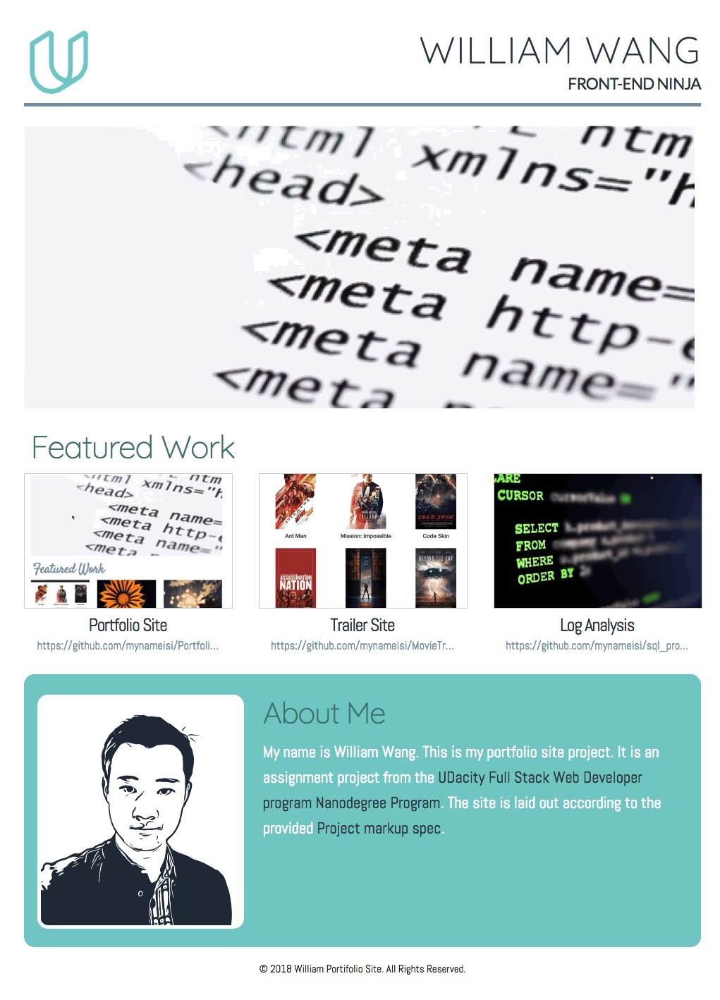

# Portfolio Site Project
This project contains server side code(HTML,CSS and related resources) that builds a responsive portfolio site. The site is layed out according to the provided [project markup spec](https://github.com/mynameisi/Portfolio_site_project/blob/master/design-mockup-portfolio.pdf). This is an assignment project from the [UDacity Full Stack Web Developer program Nanodegree Program](https://www.udacity.com/course/full-stack-web-developer-nanodegree--nd004).

contained in the `Portfolio_site_project` folder are the following content:
1. `index.html` the main file to be opened to show the site
2. folder:`images` images shown in this site
3. folder:`css` this folder contains the css files for the site
   1. `style.css` my personal styling of the site
   2. `normalize.css` & `skeleton.css` css files for the [skeleton framework](http://getskeleton.com/) UNMODIFIED.
   3. `magnific-popup.css` css file for the [magnific-popup framework](http://dimsemenov.com/plugins/magnific-popup/) UNMODIFIED.
4. folder:`scripts`
   1. `jquery.magnific-popup.js` javascript file for the [magnific-popup framework](http://dimsemenov.com/plugins/magnific-popup/).

- The css styling of the project is build on top of the [skeleton framework](http://getskeleton.com/).
- The image popup effect is build on top of the [magnific-popup framework](http://dimsemenov.com/plugins/magnific-popup/).
- `index.html` and `style.css` both passed the [W3C validator](https://validator.w3.org/).
- This site is built according to the [UDacity: Build a Portfolio Site project rubric](https://review.udacity.com/#!/rubrics/45/view).

## Prerequisites

This project is build to be responsive and is tested against multiple browsers on devices with different viewing dimentions.

## Deployment

clone the project from my GitHub repository

```
git clone https://github.com/mynameisi/Portfolio_site_project.git
```

## Running the site

Simply open the file `index.html` with a browser on your device to show the site.

## Site Outlook


## TODO

The next step is to really deploy the site so that it can be accessed via the internet.

## License

This project is licensed under the MIT License - see the [LICENSE.md](LICENSE.md) file for details
